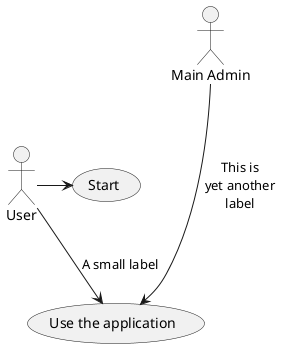
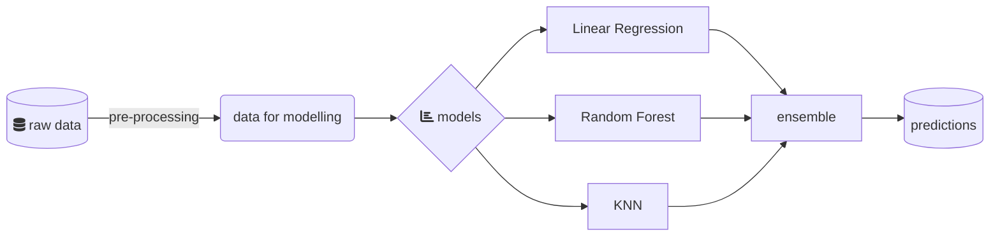

# sample_data

For example this is a Block level $$x = {-b \pm \sqrt{b^2-4ac} \over 2a}$$ formula, and this is an inline Level $x = {-b \pm \sqrt{b^2-4ac} \over 2a}$ formula.

\\[ \frac{1}{\Bigl(\sqrt{\phi \sqrt{5}}-\phi\Bigr) e^{\frac25 \pi}} =
1+\frac{e^{-2\pi}} {1+\frac{e^{-4\pi}} {1+\frac{e^{-6\pi}}
{1+\frac{e^{-8\pi}} {1+\ldots} } } } \\]

First Header | Second Header
------------ | -------------
Content from cell 1 | Content from cell 2
Content in the first column | Content in the second column

